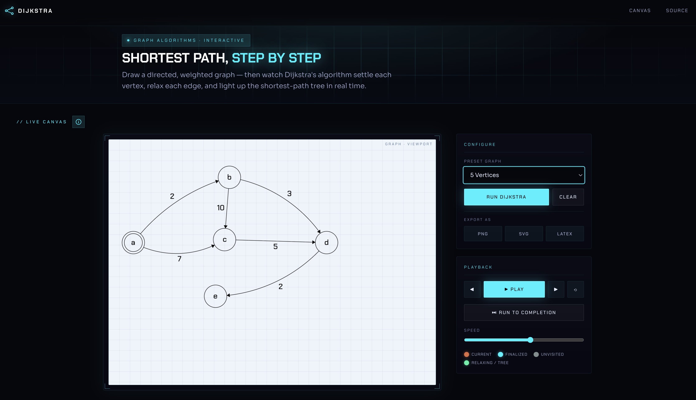

# Dijkstra's Algorithm Visualizer

An interactive, step-by-step visualizer for Dijkstra's shortest-path algorithm.
Draw a directed, weighted graph on the canvas, then watch the algorithm settle
each vertex, relax each edge, and light up the shortest-path tree in real time.



## Features

- **Interactive canvas** — build a directed, weighted graph by hand, or load a
  built-in preset.
- **Step-by-step playback** — play, pause, step forward and back, run to
  completion, and control the speed. Each step is narrated in plain English.
- **Live state** — a distance table and color legend track every vertex's
  tentative distance and status (current, finalized, unvisited) as the
  algorithm runs.
- **Path tracing** — after a run, click any vertex to see its shortest path
  from the source, highlighted on the canvas with its total distance.
- **Export** — download the graph as PNG, SVG, or LaTeX (TikZ), with the
  algorithm's colors preserved.

## Usage

Because the app is a static site with no build step, you can serve it with any
static file server:

```
python3 -m http.server
```

Then open <http://localhost:8000> in a browser.

### Drawing a graph

- **Add a vertex** — double-click empty canvas.
- **Set the source** — double-click an existing vertex.
- **Add an edge** — shift-drag from one vertex to another; the number you type
  is the edge weight.
- **Move something** — drag it around.
- **Delete something** — click it, then press the Delete key (not Backspace).
- **Numeric subscript** — put an underscore before the number (like `S_0`).
- **Greek letter** — put a backslash before it (like `\beta`).

Once the graph is drawn, pick a source and press **Run Dijkstra**.

## How it works

Dijkstra's algorithm solves the single-source shortest-path problem. For a
source vertex, it computes, for every other vertex, the shortest distance from
the source (`dist`) and the predecessor on that shortest path (`pred`). The
predecessor pointers together form the shortest-path tree, which the visualizer
highlights and uses to reconstruct any vertex's path.

Because the graph is directed, only edges leaving a vertex are followed during
relaxation. The algorithm assumes non-negative edge weights.

## Built with

Vanilla HTML, CSS, and JavaScript — no frameworks and no dependencies. The graph
editor is built on top of [FSM Designer](https://madebyevan.com/fsm/) by Evan
Wallace.

## License

MIT. See [LICENSE](LICENSE).
